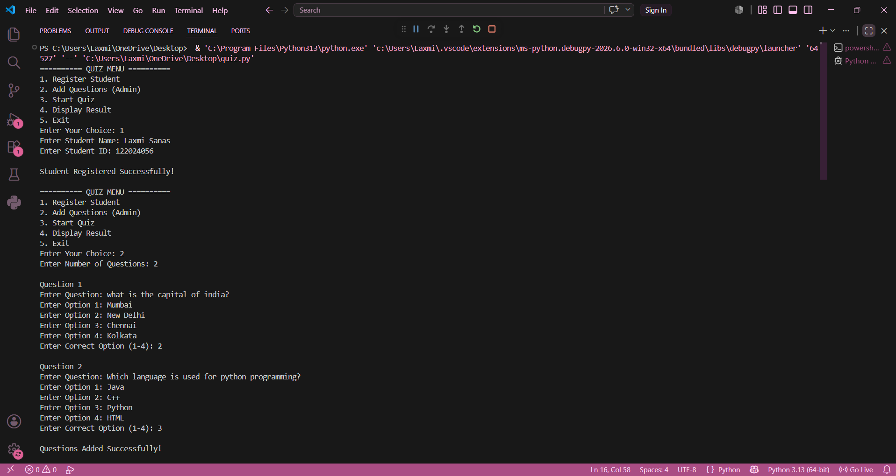
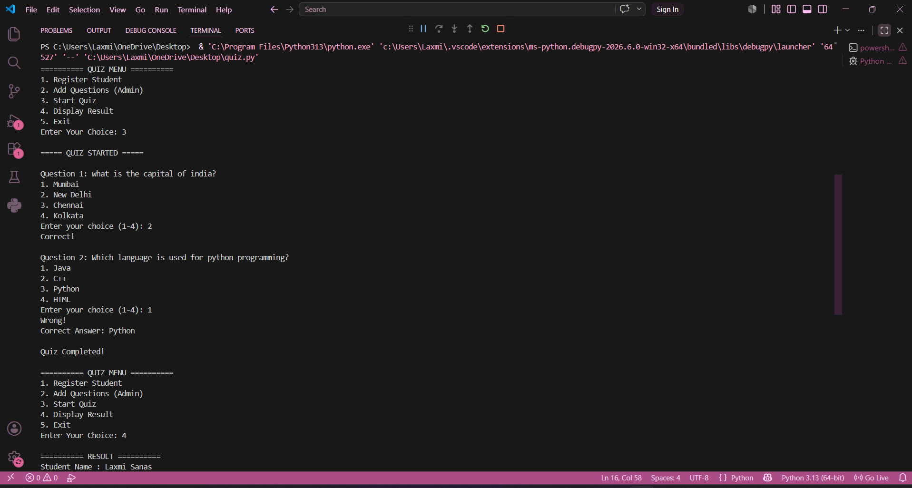
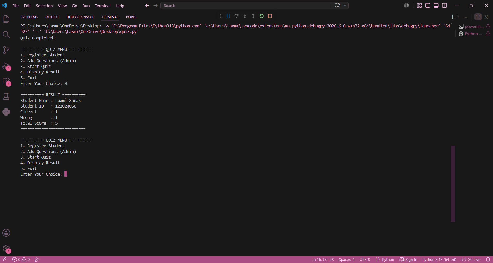

# Multiple-Choice Quiz Assessment System

## 📌 Project Overview

The Multiple-Choice Quiz Assessment System is a Python command-line application that allows an administrator to create multiple-choice questions and students to take quizzes. The system automatically evaluates answers and displays the final score.

---

## 🚀 Features

- Student Registration
- Admin Question Management
- Multiple Choice Quiz
- Automatic Score Calculation
- Instant Result Display
- Menu-Driven Interface
- Object-Oriented Programming (OOP)

---

## 🛠 Technologies Used

- Python
- Object-Oriented Programming (OOP)
- Lists
- Loops
- Conditional Statements
- Command Line Interface (CLI)

---

## 📂 Project Structure

```
Multiple-Choice-Quiz-System/
│── quiz.py
│── README.md
│── LICENSE
│── screenshots/
└── output.txt
```

---

## ▶️ How to Run

1. Install Python.
2. Download or clone this repository.
3. Open a terminal.
4. Run the following command:

```bash
python quiz.py
```

---

## 📷 Sample Output

```
========== QUIZ MENU ==========
1. Register Student
2. Add Questions
3. Start Quiz
4. Display Result
5. Exit
```

---

## 📸 Project Screenshots

### Main Menu


### Quiz


### Result


## 📈 Future Enhancements

- Store questions in a database
- Add login authentication
- Create a GUI using Tkinter
- Add a timer for each question
- Save multiple student results

---

## 👨‍💻 Author

**Laxmi Sanas**

---

## ⭐ If you like this project

Please give this repository a Star ⭐
